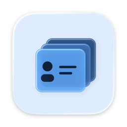
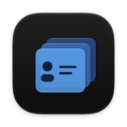

# Profile Deck

 

The app icon uses a light blue default and Icon Composer's System Dark
background for dark appearance, plus a system-generated monochrome appearance.

A native macOS companion for separate ChatGPT/Codex profiles with one shared working environment.

Profile Deck controls the installed official client. Each account keeps independent authentication and runtime data. The companion provides a profile manager, menu-bar switcher, optional floating tabs, shared-source inspection, supported configuration operations and reviewed handoffs.

## Install

Profile Deck 0.2.3 (build 33) supports Apple silicon Macs running macOS 26 or
later. Download the signed and notarized
[Profile Deck DMG](https://github.com/Kian-hdr/profile-deck/releases/tag/v0.2.3),
open it, and move **Profile Deck.app** to Applications. The matching Homebrew cask
is available from the [Kian-hdr tap](https://github.com/Kian-hdr/homebrew-tap):

```sh
brew install --cask Kian-hdr/tap/profile-deck
```

For an agent-guided installation, copy the [setup prompt](SETUP-PROMPT.md) into
an agent with access to your Mac. The official ChatGPT/Codex client is installed
separately; Profile Deck does not bundle it or anyone's account credentials.

## Current capabilities

Thin, color-coded usage bars fill from empty to full as consumption increases, including weekly and 5-hour limits where present. Model-specific limits retain their own labels and reset times. Subscription quota comes from the official client's bundled account reader. API-key accounts can link an existing Prompt Balance source for organization-wide spending; Profile Deck reads that local cache without accessing its billing credentials. Source selection is explicit because an API login does not establish organization ownership. Linked sources show usage against their configured monthly budget or starting credit, with dated credit checkpoints when available. Billing remains readable when the native account is closed or signed out. Missing or invalid limits explain why a percentage is unavailable. Refresh Prompt Balance for newer data; configured budgets are not provider-enforced limits.

Native task observation and direct cross-profile task submission still require a verified per-instance transport. The adapter displays task status as unavailable and offers copy-and-open handoffs. It never resumes another task to manufacture monitoring data.

## Requirements and build

- Apple silicon Mac running macOS 26 or later.
- The official ChatGPT/Codex macOS client, installed separately. Runtime
  compatibility is checked before Profile Deck acts on a native instance.
- To build from source: Xcode 26 or newer, the macOS SDK, and XcodeGen
  (`brew install xcodegen`).

```sh
./script/test.sh
./script/build_and_run.sh --build
```

The build-only command leaves any installed Profile Deck process running.
After quitting that process normally, the script can launch a development
build. `--demo` opens synthetic profiles for screenshots, and `--demo-scale`
opens 50 synthetic profiles with 1,000 metadata records. Runtime dependencies
are Apple frameworks, system SQLite, and the bundled Sparkle update framework;
no Python or Node runtime is shipped.

## First run

Review the detected native client and profiles, select the canonical shared source and workspace folders, then adopt selected profiles. Adoption registers existing directories in place. It does not rewrite credentials or merge histories. Profile configuration changes have a separate review/apply action.

Open an existing profile to focus its native window. Create and open saves a new isolated profile, shows preparation progress and opens its native client for sign-in. Setup failures retain the registration and explain how to retry Open profile. Only one updated manager can own the profile database at a time. The API-key action is explicit and sends a key through the provider helper's standard input, never a command argument.

The same shared skills, AGENTS.md and local memories can be referenced by all profiles. Per-account native/cloud settings, connector authorization and tool entitlement can differ. The health view distinguishes shared files, discovery and authenticated use.

### MCP sign-in with several accounts

In **Integrations**, select an account and choose **Connect MCP…**. Profile Deck reads MCP servers from that account's Codex home, including plugin-provided servers. Before connecting, **Prepare separate MCP credentials** sets a per-home credential file with a versioned provider configuration write; the native account must be closed for this step. Codex keeps previous keyring entries, but previously connected MCPs may need a fresh sign-in. The file has owner-only permissions and contains unencrypted OAuth tokens. When ready, choose the server and **Connect in account browser**. Profile Deck starts that account's OAuth flow, opens the URL in its separate Chrome session and reports Codex's completion and tool count. Sign into the matching ChatGPT account there when linking an account-hosted plugin.

**Open account browser** can also prepare the selected Chrome session before a login. For an HTTPS or loopback HTTP authorization link already opened in Chrome's other account, copy the link and choose **Open copied sign-in link**. Start a fresh sign-in if the old link has expired or was rejected.

For a directly configured HTTP MCP server, its card also offers **Copy isolated login command** as a fallback. Run it in Terminal; Codex prints an authorization link without opening the default browser. Open that link in the selected account browser, then paste the resulting callback URL into Terminal as prompted. This CLI path may not resolve an MCP server supplied only by a hosted plugin. Profile Deck does not transfer credentials or silently restart a native instance; open a new Codex task after a successful login if an existing task still reports unauthenticated tools.

## Full-screen switching

Tabs follow the profile's focused/main window, preserving its full-screen state. In Settings → General → Full-screen switching, choose **Enable window access** and allow Profile Deck in macOS Accessibility settings for window targeting. With one unambiguous native window, ordinary app activation can still work without this access. With several windows, missing permission or ambiguous window identity is reported instead of claiming the requested Space arrived.

Profile Deck runs as a menu-bar utility without a Dock icon, including while the manager is open and floating tabs are disabled. Open the manager from the menu bar or the strip's green control. Floating tabs remain optional and can join other applications' full-screen Spaces. The global Mission Control Space-switching preference is never modified.

Settings → General offers high contrast for the floating tab bar only. The manager and menu-bar popover retain their normal native appearance. Existing high-contrast choices carry over to the tab bar.

The floating strip uses one fixed-height row. Tab widths adapt within the display bounds; an explicit overflow menu keeps very large sets reachable. A closed tab is muted but remains enabled to open its verified instance; a running tab stays normal and focuses that instance. Opening, unknown and unresponsive states are labelled separately and never presented as closed. Red hides the strip, yellow is disabled, and green opens the manager. This green action is custom, not macOS zoom. Right-click for tab visibility, ordering and strip options. Hiding or closing the strip updates the menu's Show tabs control immediately.

Manual order is stored once and is shared by the manager, menu and floating strip. Drag rows in the manager or use Move up/Move down while Manual order is selected. Other sorts are temporary views and cannot silently rewrite the saved order; filtered drags reorder only the visible slots.

The real two-profile full-screen visual acceptance check remains pending; see the verification record.

## Daily use

Settings is in the manager sidebar. General, Notifications and Privacy share that window; Command-comma and the menu-bar Settings action open the same page. Opening Profile Deck presents its manager window, with menu-bar access retained.

Open Profile Deck at login is enabled by default on a new installation. The Startup section shows the actual macOS status and a Login Items link when approval is needed. Existing preferences are preserved during updates, and disabling startup remains respected on subsequent launches. Native profile startup is a separate opt-in below it.

Each profile's menu-bar card shows a prominent earned reset-credit badge only when the signed-in provider reports one or more currently available credits. Zero, missing and stale counts leave the badge hidden. The badge is separate from the scheduled quota-window reset above the usage bar, and Profile Deck never redeems credits automatically. Profiles using the same verified sign-in are marked as shared.

- Control–Option–Space is the default global shortcut; change it in Settings if occupied. Command–K or the menu also opens quick switch. Global hardware-shortcut delivery still needs a physical keyboard check.
- Closing a floating tab hides its shortcut, not its native instance.
- Quitting Profile Deck leaves native instances running and stops companion monitoring.
- The manager sidebar includes **Quit Profile Deck** for closing the companion without opening Activity Monitor.
- Shared package/configuration changes defer when an affected instance is running.
- Handoffs require review and source ownership release for overlapping edits. Copy-and-open does not submit a task.
- For chat-only context, create a ChatGPT shared-conversation link in the source profile and add it to a Handoff. The copied continuation brief includes that reviewed snapshot for the destination agent to read before it works. Private `codex://` and `chatgpt.com/c/...` deep links are intentionally rejected: they identify a source-profile conversation but do not grant another profile access to it.

## Data and recovery

Manager state lives in `~/Library/Application Support/Profile Deck`. Existing native roots stay where they are. The local database stores manager metadata, not account credentials or full conversation histories. See [privacy](PRIVACY.md) and [recovery](docs/RECOVERY.md).

Portable export includes profile labels and desired integration identifiers, not authentication, runtime state, shared document contents or source paths. Import remaps new directories and never imports logins.

## License and distribution

Profile Deck is GPL-3.0-only. Original work is copyrighted by Kian Konrad
Tajbakhsh. See [LICENSE](LICENSE), [third-party notices](THIRD_PARTY_NOTICES),
and the [dependency inventory](docs/DEPENDENCIES.md). Provider applications
and independently installed plugins retain their own licenses. No provider
endorsement is implied. Report security issues through
[private vulnerability reporting](https://github.com/Kian-hdr/profile-deck/security/advisories/new).
Review any diagnostic report locally before sharing it.

### Choose menu-bar usage previews

Right-click an account in the menu card, or use Profiles → Details → Menu-bar usage. Turn Show usage preview off to hide that account's usage, or choose individual limits such as Codex Weekly and Spark 5-hour. Choices persist across restarts; turning the preview off retains individual selections. These controls only change the menu display, not usage monitoring or alerts. The menu footer offers Open manager and a direct Show tabs / Hide tabs button. Settings remain in the manager; quit the companion through its normal application menu or Command-Q.

### Profile-switching repair (0.1.8)

Activation now prepares window targeting before acquiring focus, verifies the foreground process, and permits one bounded retry. An already-active profile is left alone. If macOS rejects both AppKit requests, an isolated public Process Manager compatibility bridge can address the exact process; that legacy path is deprecated and requires continued compatibility testing. Identity checks and cancellation apply before each request. Automatic startup is not marked as a direct user gesture.

Full-screen window identification still requires Accessibility when multiple native windows are present. Enable Profile Deck in System Settings → Privacy & Security → Accessibility to complete that setup. Process activation alone is not reported as verified arrival at a particular full-screen window. Existing account instances are never restarted as a switching repair.
